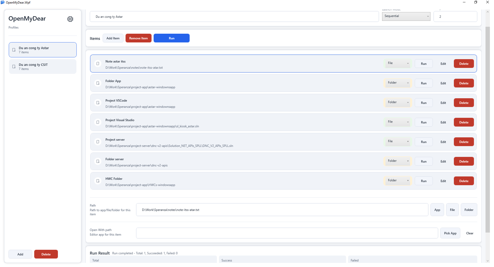
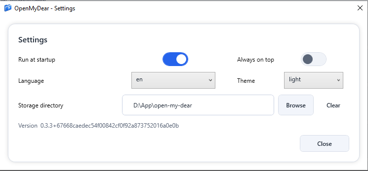

# 🚀 OpenMyDear (Tiếng Việt)

**OpenMyDear** là một ứng dụng khởi chạy quy trình làm việc (workflow launcher) hiện đại, nhẹ và mạnh mẽ dành cho Windows. Ứng dụng cho phép bạn nhóm các ứng dụng, tệp và thư mục yêu thích của mình vào các **Profile** (Hồ sơ) tùy chỉnh, giúp bạn mở tất cả chúng cùng lúc chỉ với một lần nhấp chuột.

Dù bạn đang chuyển từ chế độ "Làm việc" sang "Chơi game" hay khởi động môi trường "Lập trình" hàng ngày, OpenMyDear sẽ giúp tối ưu hóa quy trình làm việc bằng cách tự động hóa các tác vụ mở nhiều cửa sổ lặp đi lặp lại.

---

## ✨ Tính Năng Chính

-   **📁 Quản Lý Profile**: Tạo nhiều profile cho các tác vụ khác nhau (ví dụ: Lập trình, Văn phòng, Giải trí).
-   **⚡ Chế Độ Khởi Chạy Linh Hoạt**:
    -   **Parallel (Song song)**: Khởi chạy tất cả các mục cùng lúc để đạt tốc độ tối đa.
    -   **Sequential (Tuần tự)**: Khởi chạy từng mục một với thời gian chờ (delay) có thể tùy chỉnh.
-   **🔍 Tìm Kiếm Ứng Dụng**: Dễ dàng tìm và thêm các ứng dụng đã cài đặt trên Windows vào profile của bạn.
-   **📂 Hỗ Trợ Đa Dạng Nội Dung**: Thêm Ứng dụng (.exe), Thư mục và các Tệp tin riêng lẻ.
-   **🎨 Giao Diện Hiện Đại**: Giao diện sạch sẽ, trực quan, hỗ trợ chế độ **Sáng** và **Tối**.
-   **🌍 Đa Ngôn Ngữ**: Hiện hỗ trợ **Tiếng Anh** và **Tiếng Việt**.
-   **⚙️ Tự Khởi Động**: Tùy chọn tự động chạy OpenMyDear khi khởi động Windows.

---

## 📸 Ảnh Chụp Màn Hình

| Giao diện chính | Setting |
| :---: | :---: |
|  |  |

---

## 🛠️ Công Nghệ Sử Dụng

-   **Ngôn ngữ**: C#
-   **Framework**: WPF (Windows Presentation Foundation)
-   **Kiến trúc**: MVVM (Model-View-ViewModel)
-   **Lưu trữ**: Lưu trữ cấu hình và profile dựa trên định dạng JSON.

---

## 🚀 Bắt Đầu

### Yêu cầu hệ thống
-   Windows 10 hoặc 11
-   [.NET 8.0 SDK](https://dotnet.microsoft.com/download/dotnet/8.0) (hoặc cao hơn)

### Cài đặt
1.  **Clone repository**:
    ```bash
    git clone https://github.com/NHHoangTuan/open-my-dear.git
    ```
2.  **Di chuyển vào thư mục dự án**:
    ```bash
    cd open-my-dear/OpenMyDear.Wpf
    ```
3.  **Biên dịch và Chạy**:
    ```bash
    dotnet run
    ```

---

## 🤝 Đóng Góp

Mọi đóng góp đều được chào đón! Nếu bạn có ý tưởng, đề xuất hoặc báo lỗi, đừng ngần ngại:
1.  Fork dự án.
2.  Tạo nhánh tính năng (`git checkout -b feature/AmazingFeature`).
3.  Commit thay đổi của bạn (`git commit -m 'Add some AmazingFeature'`).
4.  Push lên nhánh (`git push origin feature/AmazingFeature`).
5.  Mở một Pull Request.

---

## 📜 Giấy Phép

Dự án này được cấp phép theo **MIT License** - xem tệp [LICENSE](LICENSE) để biết thêm chi tiết.

---

## ⭐ Ủng Hộ

Nếu bạn thấy dự án này hữu ích, hãy tặng cho nó một **Star** nhé! Điều này giúp nhiều người biết đến OpenMyDear hơn.

Được thực hiện với ❤️ bởi [Hoang Tuan](https://github.com/NHHoangTuan)
